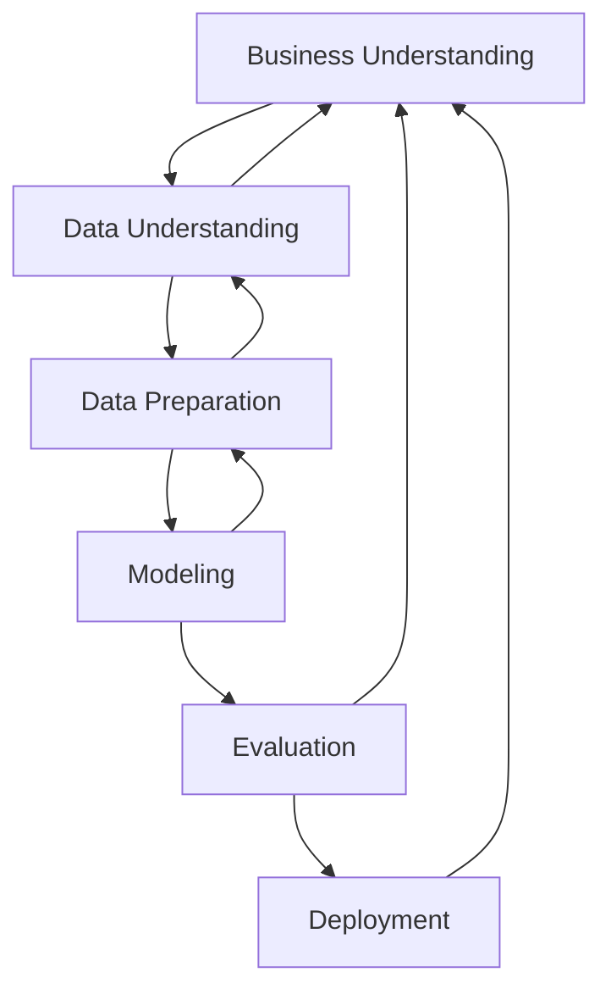

# PedalPulse Business Understanding

**CRISP-DM phase:** Business Understanding
**Status:** Chunk 1 planning specification; no dataset has been loaded
**Project:** PedalPulse: CRISP-DM Bike-Sharing Demand Prediction, Pattern Discovery, and Explainable Machine Learning

## 1. Business problem

An imaginary bike-sharing operator wants advance notice of system-wide hourly rental pressure so its operations team can prepare for peaks and troughs. PedalPulse will estimate total rentals for the next clock hour and identify recurring operating conditions and unusual demand periods.

The expected Kaggle data contain hourly aggregate rentals rather than station-level inventory and geography. Consequently, PedalPulse may support **when** to increase operational readiness, but it cannot determine **where** bicycles should be moved or produce an optimal rebalancing route. Dataset granularity will be verified in Chunk 2.

## 2. Scope

### In scope

- Rolling one-hour-ahead prediction of total hourly rental `count`.
- Calendar and weather relationships, explicitly treated as associations rather than causal effects.
- Chronological train/validation/test evaluation.
- Weekly seasonal-naive and dummy baselines.
- Training-only preprocessing, feature selection, outlier sensitivity analysis, and tuning.
- Contextual operating-condition clustering.
- Detection and investigation of unusual observations and demand periods.
- Model explanations, temporal and operational error slices, reproducibility, and an educational Streamlit interface.

### Out of scope

- Station-level bicycle placement, dock availability, or vehicle routing.
- Individual rider prediction or profiling.
- Causal estimates of weather, holidays, or policy interventions.
- Claims about unserved demand, stockout reduction, labor savings, rider satisfaction, or financial return.
- Automated live deployment or autonomous operational decisions.
- Long-term fleet-purchase optimization.

## 3. Stakeholders and supported decisions

| Stakeholder | Decisions PedalPulse may support | Decisions not supported by the available design |
|---|---|---|
| Operations controller | Raise or lower system-wide readiness for the next hour | Select the station that should receive bicycles |
| Rebalancing crews | Anticipate the timing and possible intensity of dispatch activity | Optimize routes or loading quantities |
| Intraday staffing lead | Reassign already-available staff around predicted peaks | Construct weekly rosters from a one-hour forecast |
| Service/capacity planner | Study recurring hourly, weekly, and seasonal patterns | Prove how many bicycles or docks should be purchased |
| Data-science/ML team | Monitor data quality, drift, feature behavior, errors, and retraining needs | Interpret feature importance as causal evidence |
| Management | Decide whether a controlled operational pilot is warranted | Claim return on investment without cost and pilot data |
| Riders, neighborhoods, and field staff | Affected stakeholders whose service and workload could change | No individual-level inference is justified |
| Student, professor, and reviewers | Assess methodological rigor, transparency, and reproducibility | Treat unexecuted claims as empirical evidence |

## 4. Prediction contract

| Element | Locked definition for this project |
|---|---|
| Target | Total rentals `count` for target hour \(t\) |
| Forecast origin | End of hour \(t-1\) |
| Primary horizon | One hour ahead |
| Spatial level | Expected system-wide aggregate; verify in Chunk 2 |
| Calendar inputs | Target-hour calendar values, known in advance |
| Weather inputs | Target-hour weather fields treated as proxies for operational weather forecasts |
| Historical target availability | Only observations strictly earlier than target hour \(t\) |
| Output | Finite, nonnegative point prediction; uncertainty limitations disclosed |
| Operating mode | Rolling hourly evaluation, not a simultaneous multi-day forecast |

The dataset is expected to contain realized weather rather than archived forecasts. Models using target-hour weather may therefore receive unrealistically accurate weather information. This possible optimism will be disclosed, and a later sensitivity experiment should compare a calendar-only or otherwise deployment-realistic feature set.

If the use case changes to a day-ahead or weekly batch forecast, the historical-information rule, baseline, features, and validation must be redesigned before further modeling.

## 5. Expected benefits

The following are hypotheses, not measured outcomes:

- Earlier awareness of likely demand peaks and troughs.
- More deliberate timing of system-wide operational readiness.
- Better intraday use of already-available personnel.
- Consistent descriptions of recurring operating conditions.
- Faster investigation of unusual demand periods.
- A reproducible workflow for future data and controlled pilots.

Offline predictive metrics cannot establish reduced stockouts, better station availability, lower vehicle mileage, labor savings, or financial return. Those outcomes require a later operational pilot with station inventory, intervention, cost, and service-level data.

## 6. Seasonal-naive baseline

The primary benchmark is a **rolling weekly seasonal-naive baseline with history-only fallbacks**.

For target timestamp \(t\):

1. Predict the observed `count` from the exact timestamp \(t-168\) hours when it exists in information already available.
2. If the exact weekly timestamp is absent, use the exact \(t-24\)-hour value when available.
3. Otherwise, use the median of the fold-training observations with the same hour of day and working-day status.
4. For a remaining cold start, use the fold-training global median.

Rules:

- Use datetime matching, never “168 rows earlier.”
- Sort chronologically and reject unresolved duplicate timestamps.
- Build fallback statistics from the fold's training data only.
- Traverse validation/test timestamps sequentially. Predict first, reveal that timestamp's observed target second, and then add it to history.
- Never use `casual`, `registered`, a future target, or a full validation/test block to construct a prediction.
- Record the fallback tier for every prediction and report exact-weekly coverage.
- Report an additional comparison on the subset where the pure weekly \(t-168\)-hour value exists.
- Use the same evaluated timestamps for paired model-versus-baseline comparisons.
- A separate training-median dummy regressor remains a secondary baseline.

This rolling rule is valid only for the locked one-hour-ahead scenario because earlier observed outcomes become available between forecasts.

## 7. Metrics and locked success criteria

Required predictive metrics are MAE, RMSE, RMSLE, and \(R^2\), with per-fold values and fold variation. Mean temporal-validation RMSLE is primary; MAE retains an operational interpretation in rentals per hour.

For any lower-is-better metric \(L\):

\[
\text{Relative improvement}(L)=
100\times\frac{L_{\text{seasonal}}-L_{\text{model}}}
{L_{\text{seasonal}}}
\]

### Minimum predictive success

A candidate is considered successful on temporal validation only if all of the following hold:

1. Mean RMSLE is at least **10.0% lower** than the full-coverage seasonal-naive baseline.
2. Mean MAE is at least **5.0% lower** than that baseline.
3. Candidate RMSLE is lower in a strict majority of validation folds.
4. All predictions used for operational evaluation are finite and nonnegative.
5. Leakage-prevention and chronological-ordering tests pass.

RMSE, \(R^2\), runtime, and all unfavorable fold results must still be reported. A model does not become preferable merely because it is more complex.

After model and pipeline choices are locked, the untouched test period is evaluated once. The project is called predictively successful only if the locked model also achieves at least 10.0% lower RMSLE and 5.0% lower MAE than the corresponding test-period seasonal baseline. Failure is a valid finding and must not trigger test-set tuning.

### Additional acceptance criteria

| Area | Criterion |
|---|---|
| Leakage | `casual` and `registered` are absent from every predictor, transformer, selector, cluster fit, and inference payload |
| Time integrity | Every training timestamp precedes its validation/test timestamps; all target-derived features use past information only |
| Peak-demand guardrail | Report performance for a high-demand range defined from training data; do not conceal degradation |
| Slice reliability | Report errors by season, weather, weekday, and demand range even if a slice is weak |
| Reproducibility | Fixed seeds, recorded package/runtime/hardware metadata, deterministic split boundaries, passing tests |
| Application | Smoke test passes and the interface labels forecasts, assumptions, and limitations accurately |
| Clean-clone readiness | No undeclared local data, credentials, caches, or absolute workspace paths are required |

No business-cost threshold is declared because no cost matrix or operational KPI data have been supplied.

## 8. Risks and limitations

| Risk or limitation | Planned response |
|---|---|
| Direct algebraic leakage through `casual` and `registered` | Feature allowlist plus automated test that fails if either enters a pipeline |
| Future-to-past contamination | Chronological splits, history-only features, fold-local preprocessing |
| Missing or irregular timestamps | Exact datetime checks and transparent baseline fallback coverage |
| Realized-weather proxy | Explicit limitation and deployment-realism sensitivity experiment |
| Aggregate counts lack station detail | Limit recommendations to system-wide timing and pattern analysis |
| Rentals may be censored demand | Do not equate recorded rentals with unconstrained customer demand |
| Missing operational variables | Document absence of inventory, outages, events, transit disruption, pricing, and routing data |
| Peak underprediction | Report high-demand errors and never remove legitimate peaks to improve scores |
| Temporal drift | Evaluate chronological folds and time slices; limit generalization claims |
| Uneven service consequences | Require human oversight and discuss the risk of reinforcing historical service patterns |
| Point forecasts omit uncertainty | State the limitation; add uncertainty analysis only if methodologically defensible |
| Correlation or explainability misread as causality | Use association language and explain model behavior only |
| Test-set overuse | Seal the test period until the entire pipeline is locked |
| Licensing and provenance | Keep raw data outside Git until redistribution rights are verified |

## 9. CRISP-DM is iterative, not a waterfall

Later evidence can require a controlled return to an earlier phase. For example:

- Timestamp gaps may require revising baseline mechanics.
- Unavailable forecast-time features may require revising the prediction contract.
- EDA may reveal invalid values requiring new preparation rules.
- Modeling may expose transformations or features that need redesign.
- Evaluation slices may show the business objective is not met.
- Deployment testing may reveal undocumented dependencies or unusable explanations.

Every iteration must record its trigger, decision, rationale, affected artifacts, and whether prior results became invalid. Iteration never permits repeated tuning on the untouched test set.

## 10. Business Understanding exit criteria

Chunk 1 is complete when:

- Stakeholders and decisions are defined.
- The one-hour-ahead forecast contract is recorded.
- Supported and unsupported claims are separated.
- The seasonal-naive baseline and fallback hierarchy are predeclared.
- Minimum improvement thresholds are fixed before modeling.
- Risks, assumptions, and limitations are logged.
- The untouched-test and change-control rules are accepted.

## 11. Evidence boundary

No dataset, baseline, model, test, runtime, application, or GitHub result has been measured in this phase. All benefits are hypothesized. All numeric thresholds are prospective acceptance criteria rather than achieved performance.
