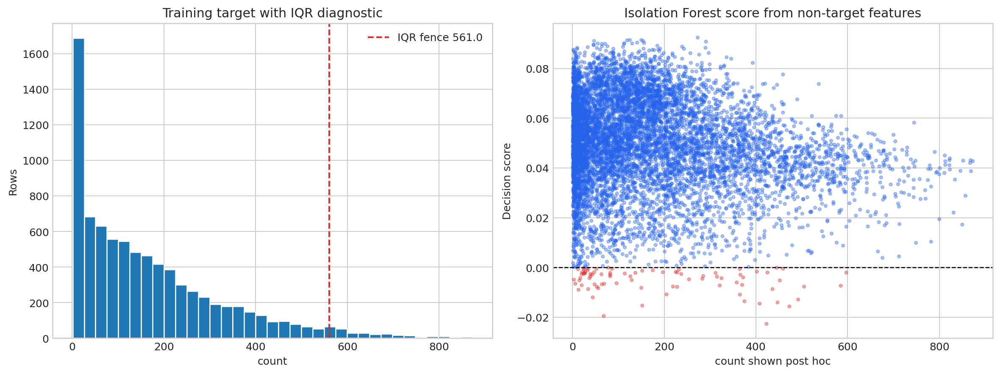
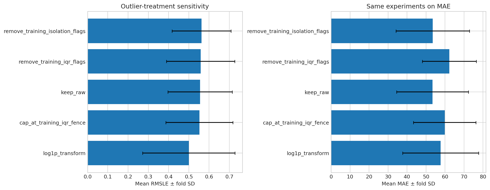
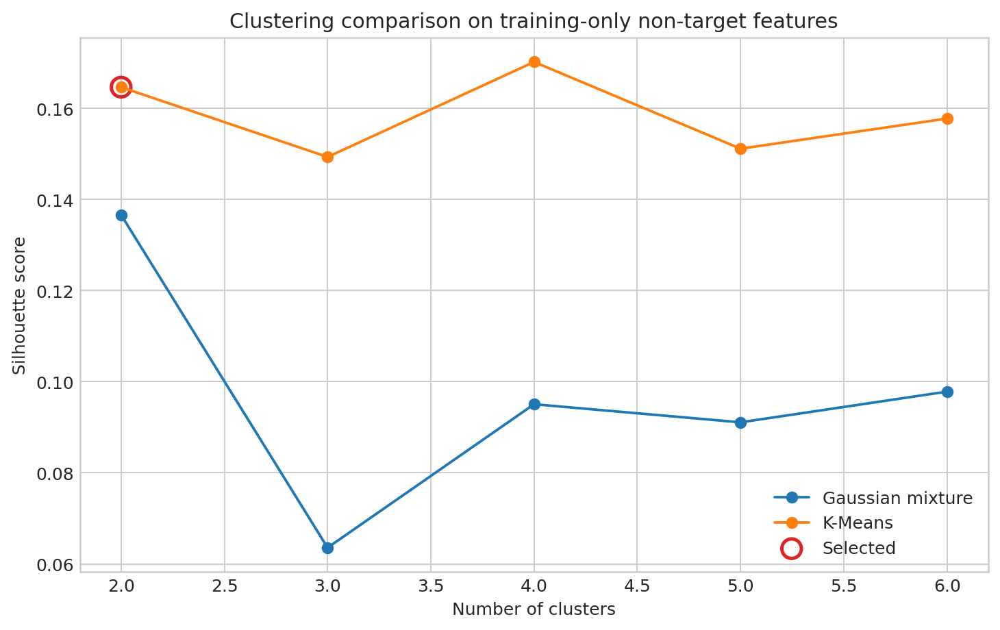
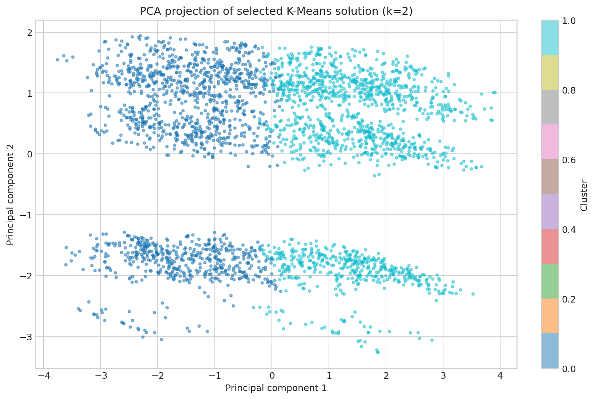
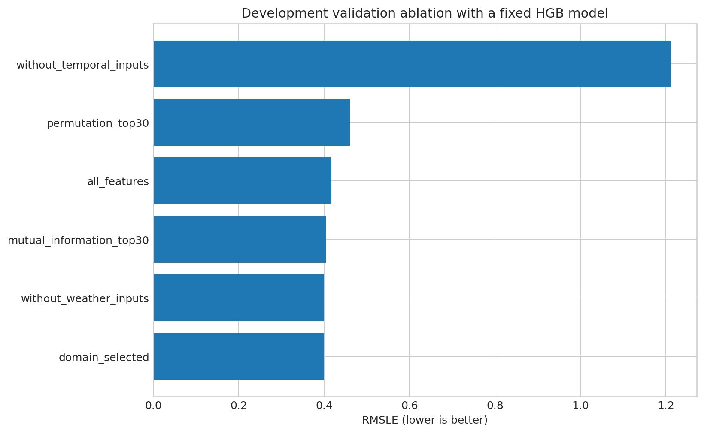

# PedalPulse Outliers, Clustering, and Feature Selection

**CRISP-DM phase:** Data Preparation / Modeling iteration
**Locked-test usage:** 0 rows. All decisions use training or development validation only.

## Outlier evidence

The training-only demand IQR upper fence is **561.00**. It flags **258 rows (3.17%)**. The most common flagged hour is **17:00**, and **71.3%** of flagged periods are working days. This timing is consistent with legitimate demand peaks, not proof of invalid records. Domain-rule violations were **0**.

Isolation Forest, fitted only on non-target features with 1% contamination, flagged **82** training periods; only **2** overlapped the target-IQR flags. Its contamination level is a diagnostic operating point, not an estimated true anomaly rate.

The best mean RMSLE in the fixed-model sensitivity table was produced by **log1p_transform** (0.4997; MAE 57.68). This does not authorize deletion: keeping, capping, log-transforming, and removal strategies change the learning problem, and the untouched test has not been evaluated.

## Clustering

K-Means and diagonal-covariance Gaussian mixtures were compared for k=2–6 using training-only, standardized, non-target features. The operational size rule required every cluster to contain at least 5% of training periods. The selected solution is **K-Means with k=2**, silhouette **0.1646**, and minimum cluster share **49.4%**.

`count` was not used to fit or select clusters. Post-hoc demand summaries are included only to translate segments into operational language.

- **Morning workday conditions (cluster 0):** 49.5% of training periods; dominant hour 06:00; post-hoc mean count 113.4.
- **Mixed daytime conditions (cluster 1):** 50.5% of training periods; dominant hour 15:00; post-hoc mean count 221.1.

PCA is a two-dimensional projection for visualization; overlap in the plot does not invalidate higher-dimensional separation.

## Feature selection and ablation

Domain-selected features, training-only mutual information, and inner-temporal-validation permutation importance were compared. The best fixed-HGB development-validation subset was **domain_selected** with **27 features** and RMSLE **0.3997**.

This is development evidence, not final generalization evidence. Selection rankings were never computed on the locked test.
