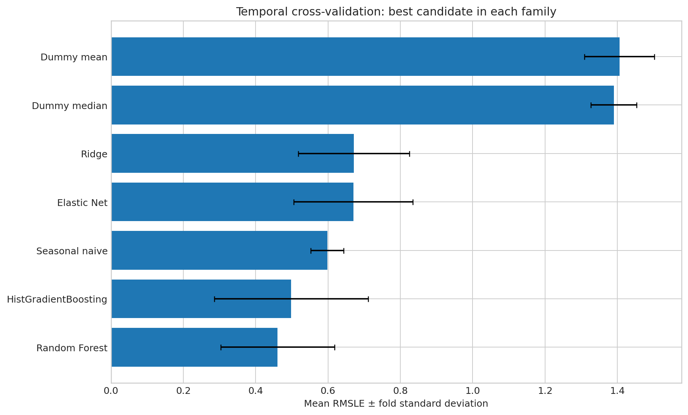
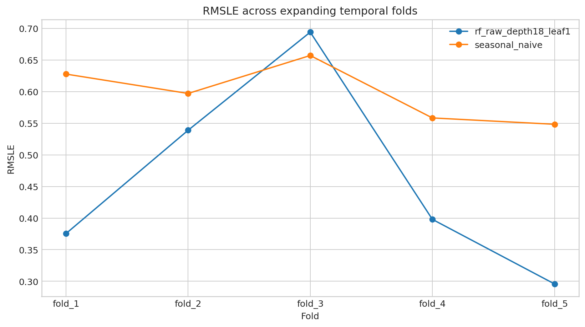

# PedalPulse Baselines and Supervised Modeling

**CRISP-DM phase:** Modeling
**Validation:** Five expanding quarterly folds; no random shuffling.
**Locked-test usage:** 0 rows. Final test evaluation remains deferred to Chunk 7.

## Selected development candidate

The best learned candidate by mean RMSLE is **rf_raw_depth18_leaf1** (Random Forest, target scale `raw`).

| Metric | Five-fold mean |
|---|---:|
| MAE | 55.200 |
| RMSE | 80.960 |
| RMSLE | 0.4604 |
| R² | 0.7385 |

RMSLE fold standard deviation is **0.1573**. Fold-level results, not only averages, are retained in the tables.

## Seasonal-naive comparison

The rolling one-hour-ahead seasonal baseline achieved mean RMSLE **0.5977** and MAE **58.855**. The selected candidate improved mean RMSLE by **22.97%** and mean MAE by **6.21%**, and beat seasonal-naive RMSLE in **4 of 5 folds**. The predeclared development criteria are **passed**.

## Interpretation

- Mean and median dummy baselines, seasonal naive, Ridge, Elastic Net, Random Forest, and HistGradientBoosting were executed.
- Small candidate grids were used; exhaustive tuning was deliberately avoided.
- Raw and `log1p` targets were compared where appropriate, with `expm1` used for log-scale predictions.
- Predictions were clipped to zero before metrics because negative rental counts are operationally invalid.
- XGBoost was skipped because it was not installed; no package was silently added.
- The development winner is a candidate for Chunk 7, not yet a final tested model. Complexity alone was not used as a selection rule.
