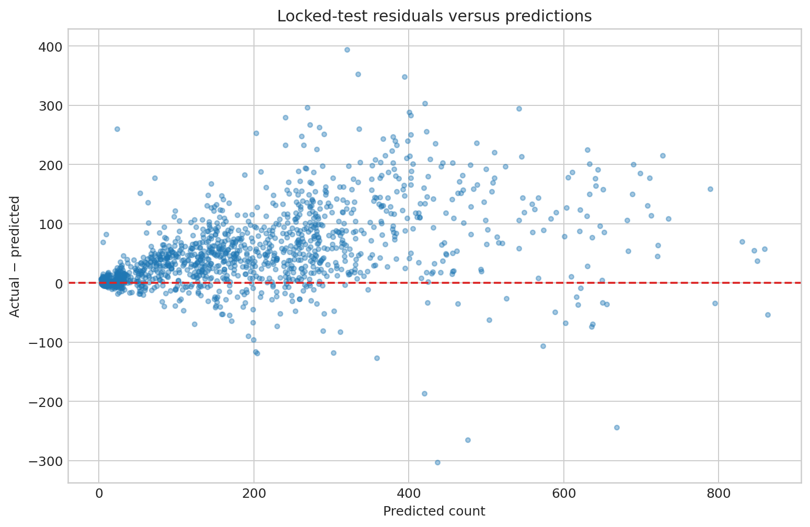
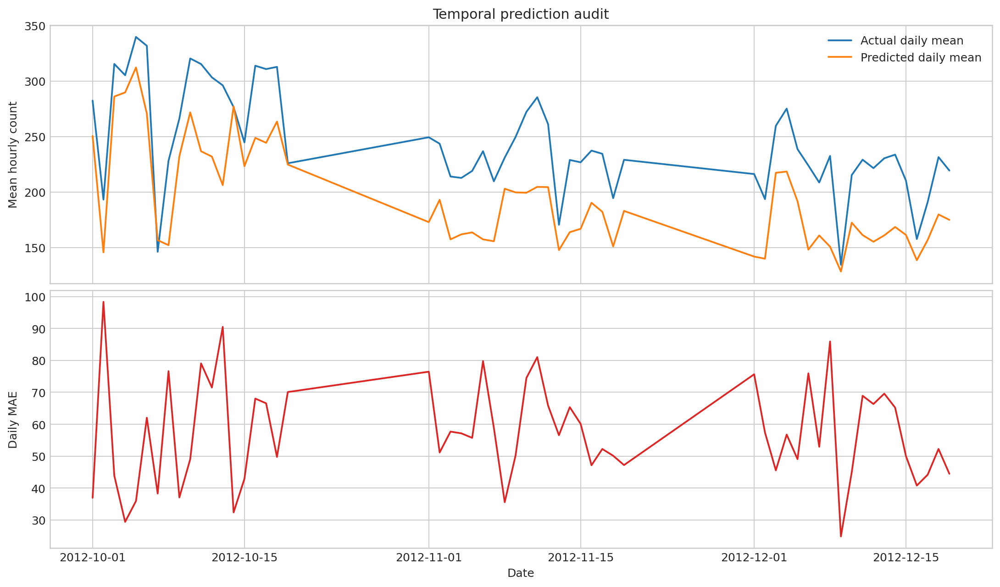
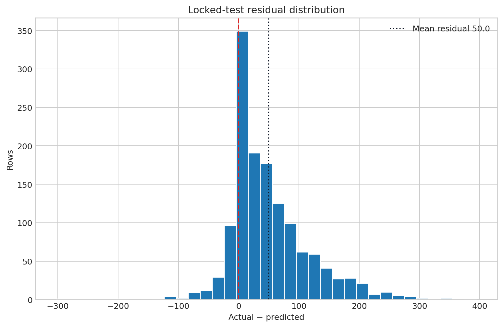
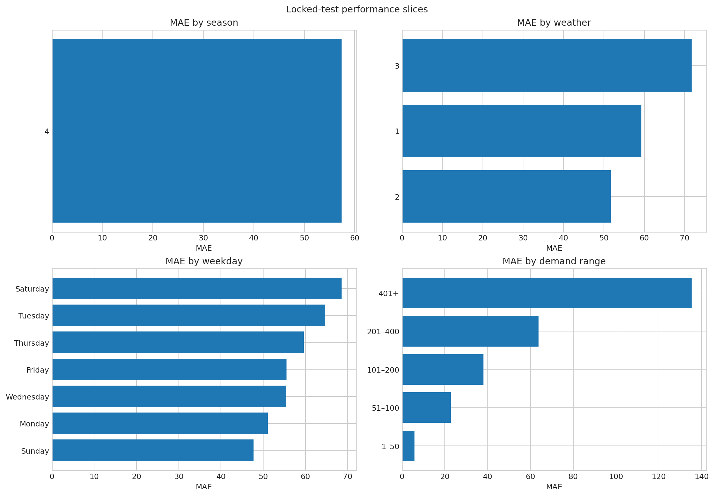
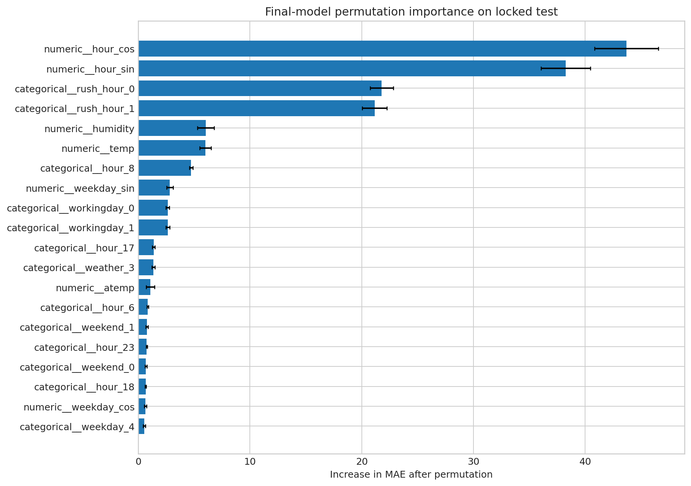
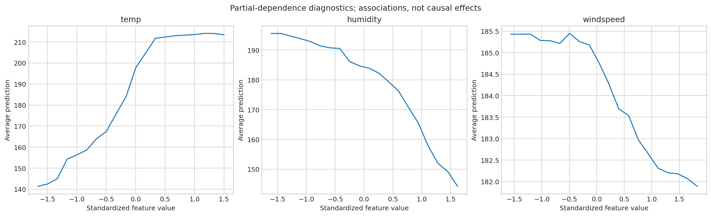

# PedalPulse Final Evaluation and Audit

**CRISP-DM phase:** Evaluation
**Locked candidate:** `rf_raw_depth18_leaf1`
**Locked-test evaluation count:** 1

## Final locked-test results

| Metric | Final model | Seasonal naive |
|---|---:|---:|
| MAE | 57.409 | 62.737 |
| RMSE | 83.410 | 106.176 |
| RMSLE | 0.3739 | 0.5255 |
| R² | 0.8327 | 0.7289 |

Relative to seasonal naive, the final model changed RMSLE by **28.85%** and MAE by **8.49%**. Positive values mean improvement. The final-test thresholds were met.

## Residual audit

Mean residual (`actual − predicted`) is **49.970**, median residual **34.608**, and residual standard deviation **66.809**.

Because the residual definition is `actual − predicted`, the positive mean and median show systematic underprediction in the locked October–December period.

## Explainability and uncertainty

The top permutation feature is `numeric__hour_cos`, with mean MAE increase **43.691** when permuted. Permutation importance was computed after final evaluation for explanation only and was not used to retune the model.

SHAP status: **skipped: SHAP package unavailable**. The ensemble 10th–90th percentile spread covered **61.67%** of outcomes; it is not a calibrated interval.

## Drift and generalization

The largest development-to-test drift screen is **month**, total_variation_distance = **0.856**. Calendar-season drift is expected because the locked test covers October–December. Drift statistics describe distribution differences, not causes.

The test period contains only season code 4, so the season slice is descriptive of that quarter and cannot support a between-season comparison.

Generalization beyond 2011–2012, to individual stations, or to unconstrained demand is unsupported. Operational use requires monitoring and periodic retraining with newer data.

## Leakage and reproducibility audit

- Training input columns contain neither `casual`, `registered`, nor `count`.
- Preprocessing was fitted on development rows only.
- Test outcomes were used only after candidate and hyperparameters were locked.
- Random seed, package versions, runtime, hardware, input hash, and exact candidate configuration are recorded.
- Raw data were not modified or bundled.
