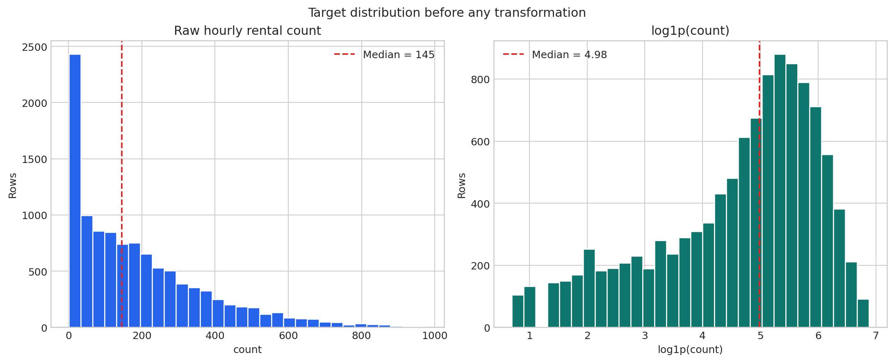
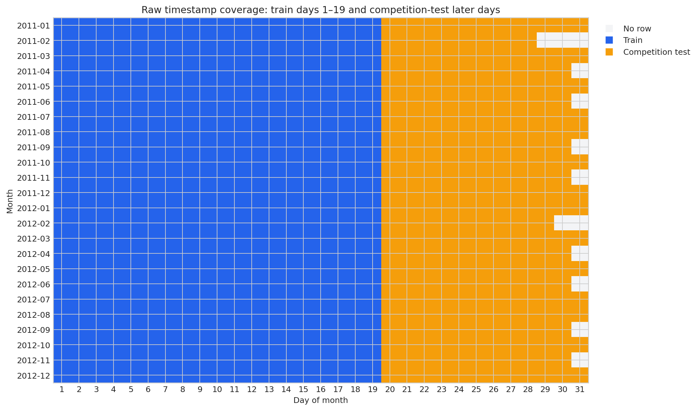
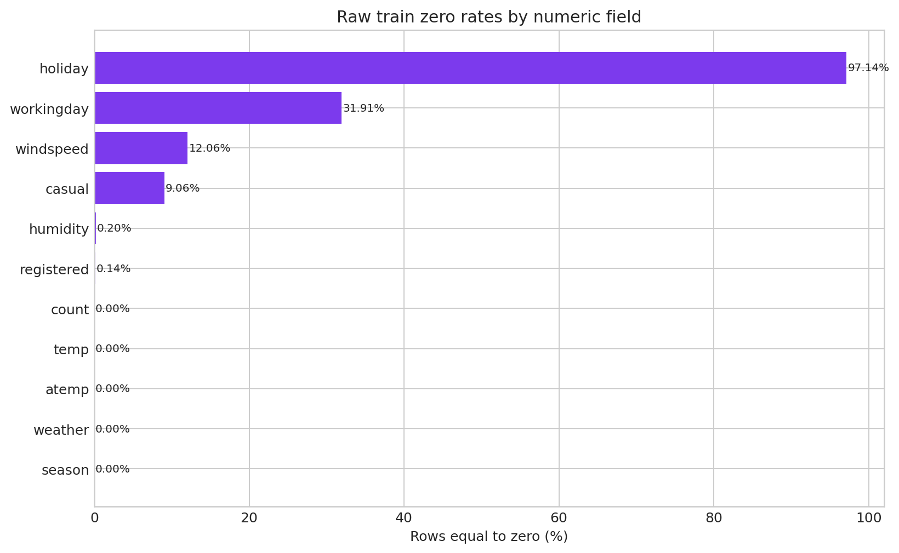
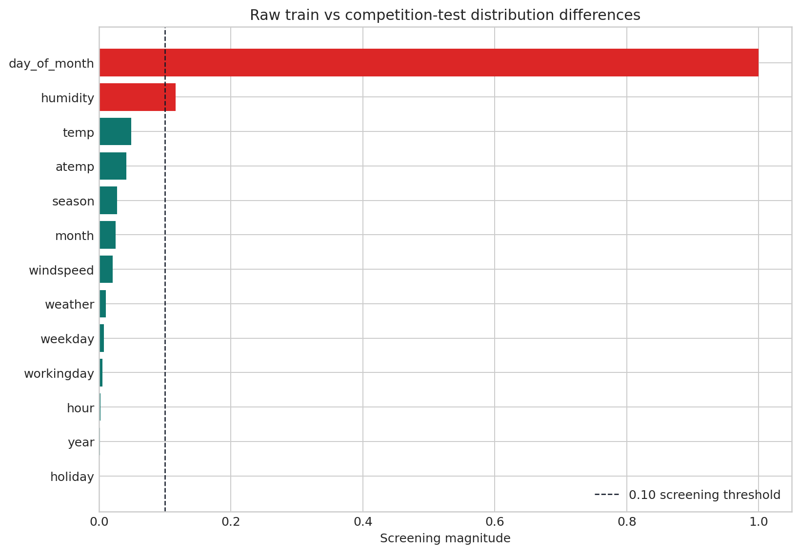

# PedalPulse Raw Data Quality Report

**CRISP-DM phase:** Data Understanding
**Evidence boundary:** Raw CSVs were read and fingerprinted. No cleaning, imputation, deletion, capping, feature engineering, modeling, or target-based split selection was performed.

## 1. File inventory

| dataset | filename | size_bytes | rows | columns | encoding_check | line_endings | sha256 |
|---|---|---|---|---|---|---|---|
| train | train.csv | 648353 | 10886 | 12 | ASCII-compatible | LF | 0cf70c35eeb6405a40cc9e124854e2da901fa88fe7374a75d141e7401bf4c857 |
| competition_test | test(1).csv | 323856 | 6493 | 9 | ASCII-compatible | LF | 3f1d0ebb197ba9b9a79280b30912093ce18959fac6e1931691092cda449eb63e |
| sample_submission | sampleSubmission.csv | 142861 | 6493 | 2 | ASCII-compatible | LF | 58c27951183b10437d6752cf5bac708ae9f80490d991c24ff76de296f71cb2f2 |

## 2. Raw shapes and schemas

- `train.csv`: **10,886 rows × 12 columns**.
- Competition test: **6,493 rows × 9 columns**.
- Sample submission: **6,493 rows × 2 columns**.
- Train-only columns: `casual, registered, count`.
- Shared train/test dtypes match: **True**.
- Sample-submission timestamps align exactly with competition test: **True**.
- All sample-submission `count` values are placeholders equal to zero; they are not observed outcomes.

| column | pandas_dtype | non_null_count | missing_count | unique_count |
|---|---|---|---|---|
| datetime | object | 10886 | 0 | 10886 |
| season | int64 | 10886 | 0 | 4 |
| holiday | int64 | 10886 | 0 | 2 |
| workingday | int64 | 10886 | 0 | 2 |
| weather | int64 | 10886 | 0 | 4 |
| temp | float64 | 10886 | 0 | 49 |
| atemp | float64 | 10886 | 0 | 60 |
| humidity | int64 | 10886 | 0 | 89 |
| windspeed | float64 | 10886 | 0 | 28 |
| casual | int64 | 10886 | 0 | 309 |
| registered | int64 | 10886 | 0 | 731 |
| count | int64 | 10886 | 0 | 822 |

## 3. Raw sample rows

The first five records, including the original CSV line numbers:

| sample_position | csv_line_number | datetime | season | holiday | workingday | weather | temp | atemp | humidity | windspeed | casual | registered | count |
|---|---|---|---|---|---|---|---|---|---|---|---|---|---|
| head | 2 | 2011-01-01 00:00:00 | 1 | 0 | 0 | 1 | 9.84 | 14.395 | 81 | 0 | 3 | 13 | 16 |
| head | 3 | 2011-01-01 01:00:00 | 1 | 0 | 0 | 1 | 9.02 | 13.635 | 80 | 0 | 8 | 32 | 40 |
| head | 4 | 2011-01-01 02:00:00 | 1 | 0 | 0 | 1 | 9.02 | 13.635 | 80 | 0 | 5 | 27 | 32 |
| head | 5 | 2011-01-01 03:00:00 | 1 | 0 | 0 | 1 | 9.84 | 14.395 | 75 | 0 | 3 | 10 | 13 |
| head | 6 | 2011-01-01 04:00:00 | 1 | 0 | 0 | 1 | 9.84 | 14.395 | 75 | 0 | 0 | 1 | 1 |

The last five records are preserved in `tables/raw_sample_rows.csv`.

## 4. Completeness, duplicates, and validity

- Missing cells in train: **0**.
- Fully duplicated train rows: **0**.
- Duplicate train timestamps: **0**.
- Timestamp parse failures: **0**.
- Range/logical checks requiring error-level review: **0**.

| check_id | field | rule | severity | violations | status |
|---|---|---|---|---|---|
| Q001 | datetime | parseable timestamp | error | 0 | PASS |
| Q002 | datetime | unique timestamp | error | 0 | PASS |
| Q003 | all columns | no fully duplicated row | error | 0 | PASS |
| Q004 | season | value in {1,2,3,4} | error | 0 | PASS |
| Q005 | holiday | value in {0,1} | error | 0 | PASS |
| Q006 | workingday | value in {0,1} | error | 0 | PASS |
| Q007 | weather | value in {1,2,3,4} | error | 0 | PASS |
| Q008 | humidity | 0 <= humidity <= 100 | error | 0 | PASS |
| Q009 | temp | temp is finite and nonnegative | error | 0 | PASS |
| Q010 | atemp | atemp is finite and nonnegative | error | 0 | PASS |
| Q011 | windspeed | windspeed is finite and nonnegative | error | 0 | PASS |
| Q012 | casual | casual is finite and nonnegative | error | 0 | PASS |
| Q013 | registered | registered is finite and nonnegative | error | 0 | PASS |
| Q014 | count | count is finite and nonnegative | error | 0 | PASS |
| Q015 | count | count == casual + registered | critical | 0 | PASS |
| Q016 | workingday | workingday matches weekday and non-holiday rule | review | 0 | PASS |
| Q017 | casual | casual has integer-valued observations | error | 0 | PASS |
| Q018 | registered | registered has integer-valued observations | error | 0 | PASS |
| Q019 | count | count has integer-valued observations | error | 0 | PASS |

## 5. Cardinalities and ranges

| column | dtype | unique_count | most_frequent_value | most_frequent_count |
|---|---|---|---|---|
| datetime | object | 10886 | 2011-01-01 00:00:00 | 1 |
| season | int64 | 4 | 4 | 2734 |
| holiday | int64 | 2 | 0 | 10575 |
| workingday | int64 | 2 | 1 | 7412 |
| weather | int64 | 4 | 1 | 7192 |
| temp | float64 | 49 | 14.76 | 467 |
| atemp | float64 | 60 | 31.06 | 671 |
| humidity | int64 | 89 | 88 | 368 |
| windspeed | float64 | 28 | 0 | 1313 |
| casual | int64 | 309 | 0 | 986 |
| registered | int64 | 731 | 3 | 195 |
| count | int64 | 822 | 5 | 169 |

Complete numerical statistics—including 1st, 5th, 95th, and 99th percentiles—are stored in `tables/descriptive_statistics.csv`.

## 6. Target and leakage audit

- `count` range: **1 to 977** rentals per hour.
- Mean/median: **191.574 / 145**.
- Raw skewness: **1.242**; `log1p(count)` skewness: **-0.851**.
- Zero target rows: **0**.
- Identity rows checked: **10,886**; mismatches in `count = casual + registered`: **0**.
- `casual` and `registered` are therefore exact outcome components and remain prohibited from every feature or clustering pipeline.

| variable | rows | minimum | q01 | q05 | q25 | median | mean | q75 | q95 | q99 | maximum | standard_deviation | skewness | zero_count | zero_pct |
|---|---|---|---|---|---|---|---|---|---|---|---|---|---|---|---|
| casual | 10886 | 0 | 0 | 0 | 4 | 17 | 36.022 | 49 | 141 | 240.15 | 367 | 49.9605 | 2.4957 | 986 | 9.0575 |
| registered | 10886 | 0 | 1 | 4 | 36 | 118 | 155.5522 | 222 | 464 | 697 | 886 | 151.039 | 1.5248 | 15 | 0.1378 |
| count | 10886 | 1 | 2 | 5 | 42 | 145 | 191.5741 | 284 | 563.75 | 774.15 | 977 | 181.1445 | 1.2421 | 0 | 0 |

**Interpretation:** The raw target is right-skewed. `log1p` reduces the measured skew, but this is only a documented candidate transformation; no transformation has been applied to the raw data.

## 7. Timestamp coverage

| dataset | row_count | parse_failures | duplicate_timestamps | monotonic_in_file_order | minimum_timestamp | maximum_timestamp | unique_timestamps | full_span_expected_hours | missing_hours_in_full_span | missing_hours_pct | one_hour_transitions | transitions_over_one_hour | maximum_gap_hours | exact_t_minus_168_coverage_count | exact_t_minus_168_coverage_pct | exact_t_minus_24_coverage_count | exact_t_minus_24_coverage_pct | weekly_or_daily_coverage_count | weekly_or_daily_coverage_pct |
|---|---|---|---|---|---|---|---|---|---|---|---|---|---|---|---|---|---|---|---|
| train | 10886 | 0 | 0 | True | 2011-01-01 00:00:00 | 2012-12-19 23:00:00 | 10886 | 17256 | 6370 | 36.9147 | 10820 | 65 | 289 | 6844 | 62.8697 | 10265 | 94.2954 | 10298 | 94.5986 |
| competition_test | 6493 | 0 | 0 | True | 2011-01-20 00:00:00 | 2012-12-31 23:00:00 | 6493 | 17088 | 10595 | 62.0026 | 6436 | 56 | 457 | 2485 | 38.272 | 5834 | 89.8506 | 5902 | 90.8979 |

**Interpretation:** The Kaggle competition split is organized by day of month: training observations occupy days 1–19 and test observations occupy later days. The test file is not one future holdout and contains no target labels. PedalPulse must construct its own chronological development and final-test periods from `train.csv`.

## 8. Suspicious zeros

- Train humidity equals zero in **22** rows, concentrated on date(s): **2011-03-10**.
- Train windspeed equals zero in **1,313** rows (**12.061%**).
- Weather code 4 appears **1** time(s) in train and is too rare for reliable standalone inference.
- Competition-test `atemp` equals zero at **2** timestamp(s): 2011-01-22 01:00:00, 2011-01-22 08:00:00.
- These values are flagged, not corrected. Zero could represent a real observation, a sensor/code artifact, or missingness encoded as zero.

**Interpretation:** Zero prevalence differs sharply by field. A zero is structurally plausible for rental components, but humidity, feels-like temperature, and windspeed require domain-specific investigation before any handling decision.

## 9. Train-versus-competition-test drift screen

Continuous features:

| feature | train_mean | test_mean | standardized_mean_difference | ks_statistic | ks_pvalue | train_zero_pct | test_zero_pct |
|---|---|---|---|---|---|---|---|
| temp | 20.2309 | 20.6206 | 0.0492 | 0.0467 | 3.910e-08 | 0 | 0 |
| atemp | 23.6551 | 24.0129 | 0.0415 | 0.0411 | 2.073e-06 | 0 | 0.0308 |
| humidity | 61.8865 | 64.1252 | 0.1162 | 0.0578 | 2.995e-12 | 0.2021 | 0 |
| windspeed | 12.7994 | 12.6312 | -0.0205 | 0.018 | 0.1424 | 12.0614 | 13.3528 |

Categorical and calendar features:

| feature | source | total_variation_distance | largest_gap_category | largest_gap_percentage_points | screening_flag_tvd_ge_0_10 |
|---|---|---|---|---|---|
| season | raw | 0.0275 | 3 | 2.0467 | False |
| holiday | raw | 5.395e-04 | 1 | 0.0539 | False |
| workingday | raw | 0.0049 | 0 | -0.4941 | False |
| weather | raw | 0.0106 | 1 | -1.058 | False |
| year | timestamp_derived | 0.0017 | 2012 | 0.169 | False |
| month | timestamp_derived | 0.025 | 2 | -1.5002 | False |
| hour | timestamp_derived | 0.0025 | 4 | -0.133 | False |
| weekday | timestamp_derived | 0.0075 | 4 | 0.7088 | False |
| day_of_month | timestamp_derived | 1 | 20 | 8.8403 | True |

**Interpretation:** Shared exogenous distributions are mostly similar, with humidity producing the largest continuous mean shift. Day-of-month has total-variation distance 1.0 because the competition split is deliberately disjoint by calendar day. KS p-values are treated as screening evidence, not practical effect sizes or proof of future drift.

## 10. Principal data-quality findings

1. Direct target leakage is confirmed structurally and empirically: `count` equals `casual + registered` for every raw training row.
2. No ordinary null cells, duplicate rows, duplicate timestamps, or timestamp parse failures were measured.
3. The training timeline is not a continuous hourly sequence because later days of every month are withheld for the competition test.
4. Seasonal-naive evaluation must use exact datetime lookups and report fallback coverage; a positional row shift would be wrong.
5. Humidity zeros, windspeed zeros, competition-test `atemp` zeros, and the extremely rare weather code 4 require review rather than automatic deletion or imputation.
6. The competition test cannot measure model performance because `count` is absent and submission zeros are placeholders.
7. The attached data contain no station geography, inventory, or unserved-demand measure; interpretations remain system-wide rental forecasts.

## 11. Deferred decisions

No quality flag has been cleaned in Chunk 2. Treatment alternatives will be compared in later training-only experiments. Exact chronological split boundaries will be selected from documented timestamp coverage before modeling and without consulting performance on the future test period.
