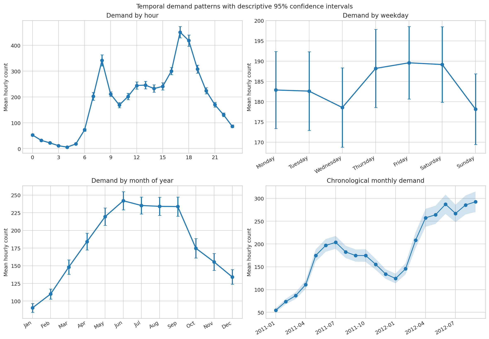
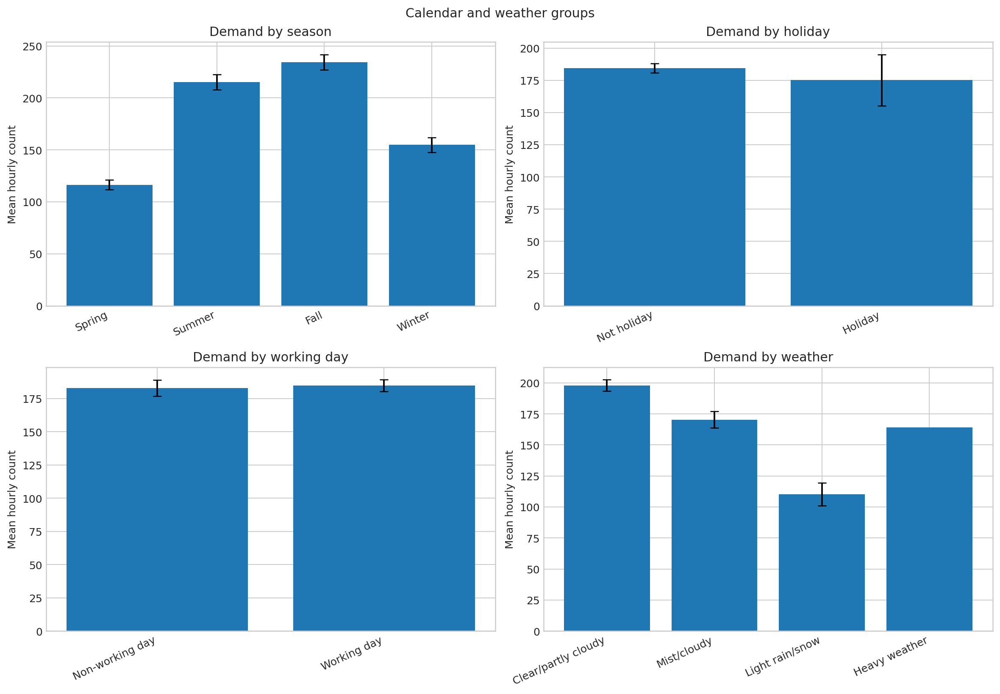
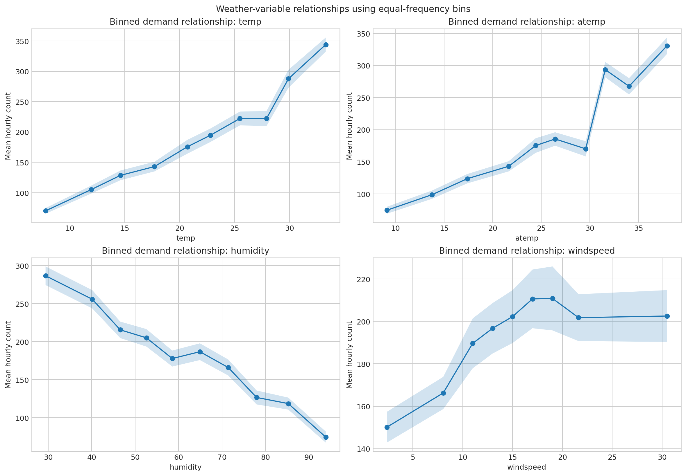
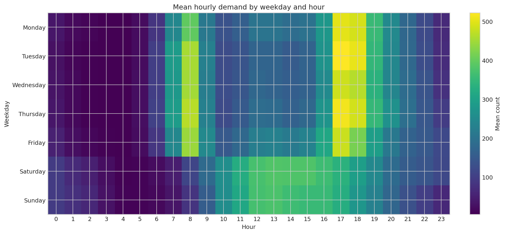
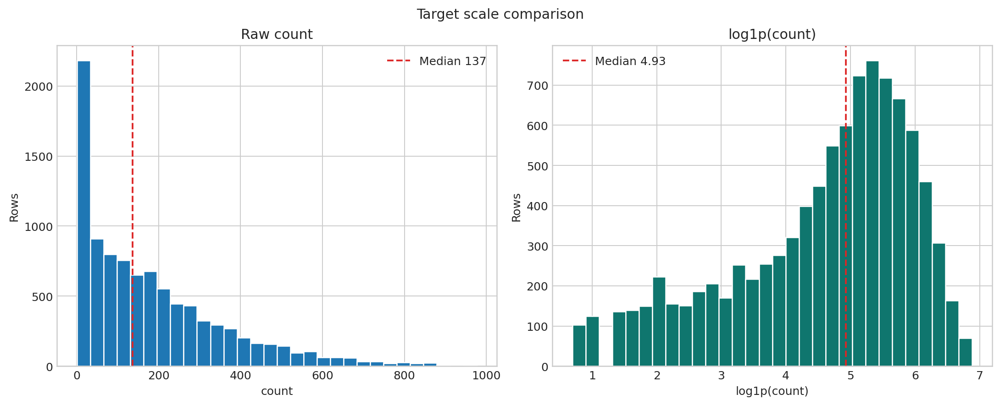
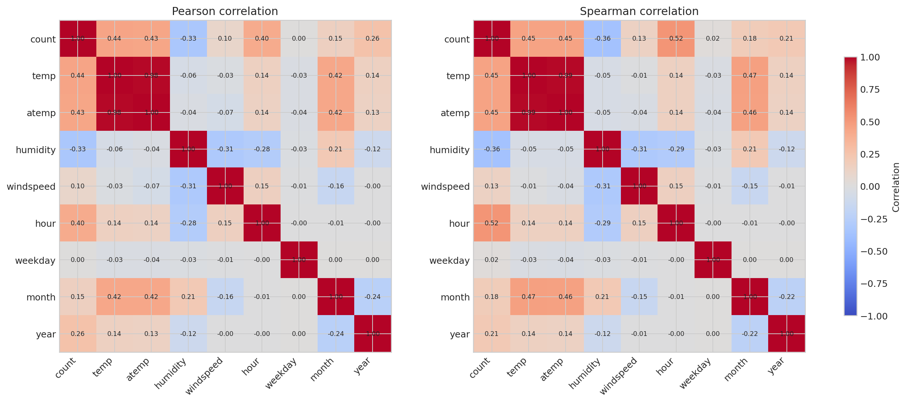

# PedalPulse Textbook-Quality EDA

**CRISP-DM phase:** Data Understanding
**Evidence boundary:** All detailed summaries use the **9,519-row development pool** (chronological train plus validation). The locked October–December 2012 test targets are excluded. `casual` and `registered` are excluded because they exactly compose the target. No cleaning, causal estimation, feature selection, or model fitting was performed in this EDA.

## Figure 1 — Temporal demand patterns

**Observed evidence:** Mean demand is highest at hour **17:00** (450.93) and lowest at hour **04:00** (6.06). The highest weekday mean is **Friday** (189.59). Across month-of-year groups, **Jun** is highest (242.03) and **Jan** is lowest (90.37). The chronological panel also shows that the two years should not be collapsed into a purely seasonal interpretation.

**Causal caution:** These patterns describe recorded rentals, not the isolated effect of clock time or month. Weather, year, working-day composition, supply availability, and unmeasured events may contribute.

## Figure 2 — Season, holiday, working-day, and weather groups

**Observed evidence:** **Fall** has the highest seasonal mean (234.42). Holiday and non-holiday means are 175.14 and 184.42; working-day and non-working-day means are 184.74 and 182.93. Weather-group means range from 110.17 to 198.02. Weather code 4 has only **1** observation, so its confidence interval and mean are not stable.

**Causal caution:** Group differences are unadjusted. The descriptive 95% intervals use a conventional independent-observation formula, while hourly time-series observations are autocorrelated; the intervals must not be interpreted as causal or fully time-series-correct uncertainty.

## Figure 3 — Temperature, feels-like temperature, humidity, and windspeed

**Observed evidence:** Pearson correlations with count are temp **0.439**, atemp **0.431**, humidity **-0.326**, and windspeed **0.099**. Equal-frequency bins expose nonlinearity that a single correlation coefficient can conceal.

**Causal caution:** These are marginal associations. Temperature and season are related, windspeed contains many zeros, and weather may interact with hour and working-day status.

## Figure 4 — Hour-by-weekday heatmap

**Observed evidence:** The largest cell mean occurs on **Tuesday at 17:00**, with mean count **522.04**. Weekday profiles show commuting-shaped peaks, while weekend profiles are distributed differently across the day.

**Causal caution:** The heatmap supports operational scheduling hypotheses, but it does not prove commuting purpose because trip-purpose labels are absent.

## Figure 5 — Raw target and `log1p` scale

**Observed evidence:** Raw `count` has mean **184.16**, median **137**, and skewness **1.291**. `log1p(count)` has skewness **-0.837**.

**Modeling caution:** Reduced skew does not establish better forecasts. Raw-target and log-target approaches must be compared using temporal validation, with log predictions converted back using `expm1`.

## Figure 6 — Correlation analysis

**Observed evidence:** The strongest absolute Pearson association with count among the displayed non-target variables is **temp** (0.439); the strongest Spearman association is **hour** (0.517).

**Warnings:** Correlation is not causation; it does not represent nonlinear interactions or temporal dependence. Codes such as weekday and month are cyclic categories, so treating their integer labels as distances is mathematically crude. `temp` and `atemp` are strongly related, which may affect linear-model coefficient stability. Outcome components `casual` and `registered` were deliberately omitted.

## Confidence-interval note

The interval tables are useful descriptive summaries. They are not a substitute for blocked temporal uncertainty estimates because repeated hourly observations are not independent. Later model comparisons will use fold-to-fold temporal variation.
