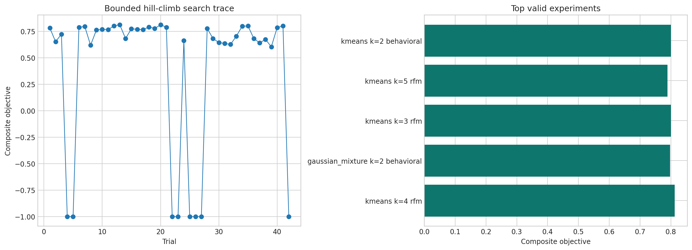
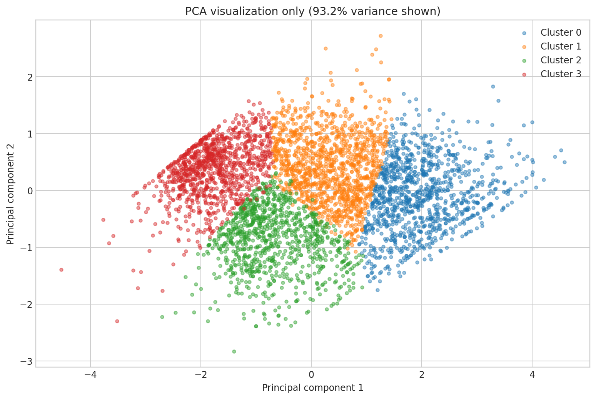
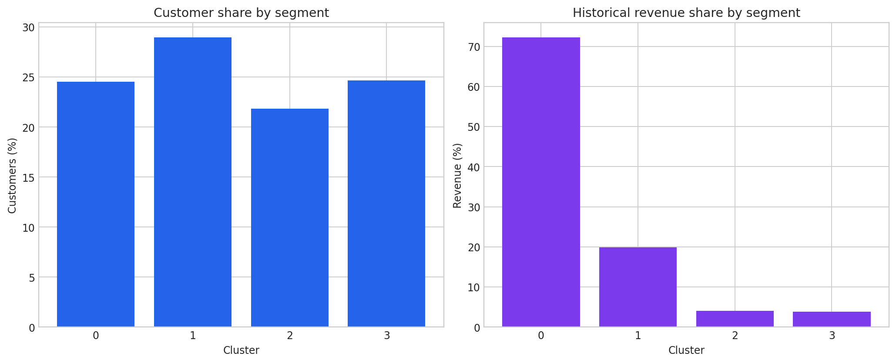

# SegmentForge: Customer Intelligence Clustering

An independent CRISP-DM replication inspired by the professor's [Customer Intelligence Clustering prompt](https://github.com/dlmastery/data_science_examples/blob/main/PROMPTS.md). This project does not copy the professor's implementation, metrics, screenshots, or conclusions.

SegmentForge transforms Online Retail transactions into customer-level RFM features, compares three clustering families, runs a bounded and auditable hill-climbing search, evaluates the locked winner on a customer audit partition, and serves the results through an eight-page Streamlit administration dashboard.

Customer identifiers in published artifacts are deterministically masked for display, not cryptographically anonymized. They must not be treated as anonymous data or joined to external personal information.

## Measured results

| Item | Result |
|---|---:|
| Raw transaction rows | 541,909 |
| Identified raw customers | 4,372 |
| Customers with valid purchases | 4,338 |
| Discovery customers | 3,443 |
| Locked audit customers | 895 |
| AutoResearch trials | 42 |
| Valid / rejected / failed trials | 34 / 8 / 0 |
| Selected algorithm | K-Means |
| Selected clusters | 4 |
| Selected features | Recency, Frequency, Monetary |
| Transformation / scaler | Yeo–Johnson / StandardScaler |
| Outlier policy | Keep |
| Discovery silhouette | 0.3331 |
| Locked-audit silhouette | 0.3383 |
| Discovery stability ARI | 0.9888 ± 0.0025 |

Internal clustering metrics are not classification accuracy. The selected configuration balanced cohesion, separation, stability, cluster size, interpretability, and complexity.





## Segments

| Cluster | Persona | Customers | Customer share | Historical revenue share | Median R/F/M |
|---:|---|---:|---:|---:|---|
| 0 | High-value frequent customers | 1,064 | 24.5% | 72.3% | 10 days / 7 invoices / £2,708.86 |
| 1 | Established mid-value customers | 1,257 | 29.0% | 19.9% | 66 days / 3 invoices / £993.54 |
| 2 | Recent occasional customers | 947 | 21.8% | 4.0% | 32 days / 1 invoice / £322.80 |
| 3 | Long-recency customers | 1,070 | 24.7% | 3.8% | 237 days / 1 invoice / £252.77 |

Personas were named after model selection using measured profiles. They are descriptive, not causal labels or guaranteed future behavior.



## CRISP-DM

1. **Business Understanding:** define descriptive segmentation uses, unsupported claims, and operational stakeholders.
2. **Data Understanding:** audit the raw workbook before cleaning, including missing identifiers, duplicates, cancellations, and nonpositive values.
3. **Data Preparation:** construct customer RFM and behavioral features using a fixed snapshot; exclude identifiers from clustering.
4. **Modeling:** compare K-Means, Gaussian Mixture, and Agglomerative clustering across transformations, scaling, feature views, cluster counts, and outlier policies.
5. **Evaluation:** combine internal metrics with subsample stability and cluster-size constraints; evaluate the locked winner on a deterministic audit population once.
6. **Deployment:** save a model bundle, aggregate artifacts, executed notebook, tests, and Streamlit admin dashboard.

## Project layout

```text
03-customer-intelligence-clustering/
├── app.py                         # eight-page Streamlit dashboard
├── abstract.md                    # concise research abstract
├── paper.md                       # paper-style report with citations
├── article.md                     # publication-ready narrative
├── configs/autoresearch.json      # frozen hill-climb policy
├── data/raw/README.md             # licensed download instructions
├── notebooks/                     # executed CRISP-DM notebook
├── src/segmentforge/              # reusable data, features, clustering, search
├── scripts/                       # download, analysis, checks, notebook, smoke test
├── tests/                         # data, leakage, determinism, search, artifact tests
└── artifacts/
    ├── experiments/               # full trial log and winning state
    ├── figures/                   # reproducible charts
    ├── models/                    # fitted clustering bundle and metadata
    ├── reports/                   # CRISP-DM, model card, data card
    └── tables/                    # aggregate evidence and masked assignments
```

## Reproduce on macOS

```bash
cd assignment-2-replications/03-customer-intelligence-clustering
python3.12 -m venv .venv
./.venv/bin/python -m pip install --upgrade pip
./.venv/bin/python -m pip install -r requirements.txt
./.venv/bin/python scripts/download_data.py
./.venv/bin/python scripts/run_pipeline.py
./.venv/bin/python scripts/build_notebook.py
./.venv/bin/python -m pytest
./.venv/bin/python scripts/smoke_test_app.py --timeout 30
./.venv/bin/python -m streamlit run app.py --server.port 8502
```

Open http://localhost:8502. Stop with `Control+C`.

## Reproduce on Windows without PowerShell activation

```bat
py -3.12 -m venv .venv
.\.venv\Scripts\python.exe -m pip install --upgrade pip
.\.venv\Scripts\python.exe -m pip install -r requirements.txt
.\.venv\Scripts\python.exe scripts\download_data.py
.\.venv\Scripts\python.exe scripts\run_pipeline.py
.\.venv\Scripts\python.exe scripts\build_notebook.py
.\.venv\Scripts\python.exe -m pytest
.\.venv\Scripts\python.exe scripts\smoke_test_app.py --timeout 30
.\.venv\Scripts\python.exe -m streamlit run app.py --server.port 8502
```

## Dataset and license

- [UCI Online Retail](https://archive.ics.uci.edu/dataset/352/online+retail)
- DOI: 10.24432/C5BW33
- License: CC BY 4.0
- The raw workbook is downloaded by each user and excluded from Git.

## Research grounding

- RFM and customer-value caution: [Fader, Hardie, and Lee](https://www.brucehardie.com/papers/rfm_clv_2005-02-16.pdf)
- K-Means: [MacQueen](https://digicoll.lib.berkeley.edu/nanna/record/113015/files/math_s5_v1_article-17.pdf?registerDownload=1&version=1&withMetadata=0&withWatermark=0)
- Gaussian-mixture expectation maximization: [Dempster, Laird, and Rubin](https://academic.oup.com/jrsssb/article/39/1/1/7027539)
- Silhouette validation: [Rousseeuw](https://doi.org/10.1016/0377-0427(87)90125-7)
- Clustering stability: [von Luxburg](https://arxiv.org/pdf/1007.1075v1.pdf)

## Limitations and ethics

- One retailer and 2010–2011 data do not establish modern generalization.
- Missing CustomerID rows cannot participate in customer-level clustering.
- Revenue concentration does not prove future lifetime value.
- Persona names can influence decisions and must remain neutral and evidence-linked.
- Segment actions are experiment hypotheses, not demonstrated business impact.
- PCA is visualization only.
- The composite search objective reflects predeclared design judgments.

## AI assistance

ChatGPT assisted with research synthesis, implementation, debugging, tests, documentation, and dashboard engineering. The student remains responsible for understanding, reviewing, executing, presenting, and submitting the work. Execution errors and corrections are recorded in `VERIFICATION_REPORT.md`.
